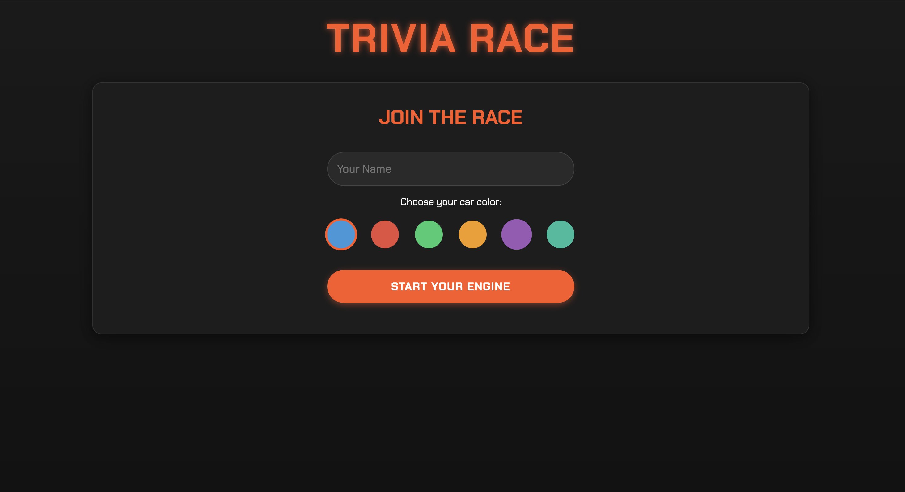

# Trivia Race Game

A multiplayer trivia game where players race to the finish line by answering questions correctly.

https://s25-websocket-juliassilvestrin-1.onrender.com/

## Overview

Trivia Race is a real-time multiplayer web game where players compete against each other by answering trivia questions. Each correct answer moves your car forward on the race track. The first player to reach the finish line by answering 5 questions correctly wins the race.

## Features

- Real-time multiplayer gameplay
- Car racing theme with visual race track
- Diverse trivia questions across various topics
- Player color selection system
- "Ready" system where all players must indicate readiness to start
- Dynamic question timer
- Non-repeating questions until all questions are used
- Mobile-responsive design

## How to Play

1. Enter your name and choose a car color
2. Click "Start Your Engine" to join the waiting room
3. Once all players have joined, click "I'm Ready" to indicate you're ready to race
4. When all players are ready, the countdown begins
5. Answer trivia questions correctly to move your car forward
6. The first player to answer 5 questions correctly wins the race

## Screenshots

## Technical Details

- Built with Node.js, Express, and WebSockets for real-time communication
- Frontend uses Vue.js for reactive UI components
- No database required - all game state is managed in server memory

## Deployment

The game was deployed using Render. 

